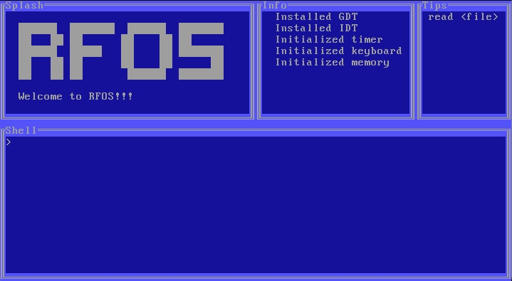

# 2024 Operating System
This project is a fun OS excursion inspired by my college operating systems class. The professor put forth a challenge to 
make an OS that performs some simple operations.

# Context and technologies used
- As I am developing this on my Mac, I had to setup quite a bit of build steps to get a functioning kernel binary out of it.
  Docker is used to run all the commands that are not supported on macos such as grub.
- I realized early on a simple Makefile wasn't going to be enough for this project so I opted for a bash script that contained
  all the build commands (see [build.sh](https://github.com/rfmineguy/2024_barebones_os/blob/master/scripts/build.sh)).

# Uncomprehensive feature list
- Global Descriptor Table
- Interrupt Descriptor Table
- Printf
- Serial port communication
- Simple VGA Driver
- Simple FAT driver
   - [X] File reading
   - [ ] File writing
- Simple shell
   - `read <filename>` - read the file from the fat system with name of 'filename'
- Terminal User Interface

# Building
NOTE: The required software for Linux/Macos, and Windows should be the same. See below.

- Required software
   + docker
   + qemu (or some other virtualization software)
      * specifically we need `qemu-system-i386`

- Optional software
   + A host C compiler (for tests)

# Step By Step
**NOTE: IT IS ALWAYS WISE TO VERIFY SCRIPT CONTENTS BEFORE RUNNING** 

## Linux/MacOS
See [LinuxMacOS_Build.md](LinuxMacOS_Build.md) for how to install on Linux/MacOS

## Windows
See [Windows_Build.md](Windows_Build.md) for how to install on Linux/MacOS

# Resources
[OliveStem OS Playlist](https://youtube.com/playlist?list=PL2EF13wm-hWAglI8rRbdsCPq_wRpYvQQy&si=q2oYblMfOZJexLc9) 
[osdev-wiki](https://wiki.osdev.org/Expanded_Main_Page) 
[Nanobyte FAT Driver](https://www.youtube.com/watch?v=7o3qx66uLz8) 
