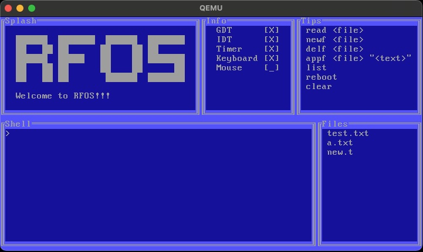

# 2024 Operating System
This project is a fun OS excursion inspired by my college operating systems class. The professor put forth a challenge to 
make an OS that performs some simple operations.



# Context and technologies used
- As I am developing this on my Mac, I had to setup quite a bit of build steps to get a functioning kernel binary out of it.
  Docker is used to run all the commands that are not supported on macos such as grub.
- I realized early on a simple Makefile wasn't going to be enough for this project so I opted for a bash script that contained
  all the build commands (see [build.sh](https://github.com/rfmineguy/2024_barebones_os/blob/master/scripts/build.sh)).

# Uncomprehensive feature list
- Global Descriptor Table
- Interrupt Descriptor Table
- Printf
- Serial port communication
- Simple VGA Driver
- Simple FAT driver
   - [X] File reading
   - [ ] File writing
- Simple shell
   - `read <filename>` - read the file from the fat system with name of 'filename'
- Terminal User Interface

# Building
- Required software
   + docker
   + qemu (or some other virtualization software)

- Optional software
   + A host C compiler (for tests)

```bash
./scripts/build.sh docker_get    # setup required docker image for build (this image will contain all software required to build)
./scripts/build.sh build         # run all build commands to generate iso
./scripts/build.sh clean         # clean up build files (including iso)
./scripts/build.sh checkmboot    # check to ensure that the kernel binary is multiboot enabled
./scripts/build.sh qemu          # run qemu with the built iso file
```

# Step By Step
```bash
# 1. Clone the repo with depth 1 (we dont need the git history here)
$ git clone https://github.com/rfmineguy/2024_barebones_os.git --depth=1
```
```bash
# 2. Retrieve and setup the docker image require to build this project
$ ./scripts/build.sh docker_get 
```
```bash
# 3. Build the iso file
$ ./scripts/build.sh build
```
```bash
# 4. Verify that the iso file is multiboot1 compatible (multiboot2 might be in the future) 
#    If this indicates that its not multiboot compatible, I broke something (oops)
$ ./scripts/build.sh checkmboot
```
```bash
# 5. Finally run the kernel in qemu
$ ./scripts/build.sh qemu
```

# Resources
[OliveStem OS Playlist](https://youtube.com/playlist?list=PL2EF13wm-hWAglI8rRbdsCPq_wRpYvQQy&si=q2oYblMfOZJexLc9)<br>
[osdev-wiki](https://wiki.osdev.org/Expanded_Main_Page)<br>
[Nanobyte FAT Driver](https://www.youtube.com/watch?v=7o3qx66uLz8)<br>
